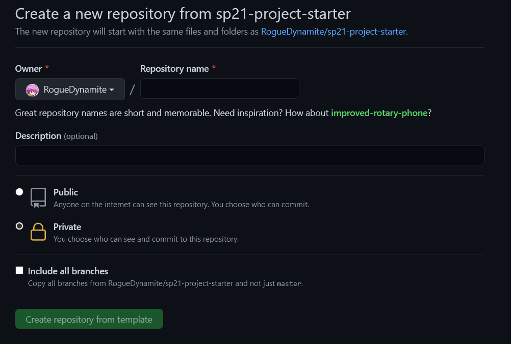

# Setup

### git

Install git [here](https://git-scm.com/downloads). Choose your operating system and install git by following the installation instructions. You may need to restart your terminal for changes to take effect.

### Golang

Please choose the latest stable version for your operating system at this [link](https://golang.org/dl/).

### Text editors

We recommend you use a good text editor when working on this project. Here are some recommendations if you can't find any:

 - [VS Code](https://code.visualstudio.com/download)
 - [Sublime Text](https://www.sublimetext.com/3)
 - [Notepad++](https://notepad-plus-plus.org/downloads/)
 - [Atom](https://atom.io/)
 - [Vim](https://www.vim.org/download.php)

You may also use a text editor not present in this list. Choose one that you find most comfortable to use.

### Docker

In order to run this project locally, you can use Docker. Each of the microservices in this project have their own Dockerfile that you will need to modify in order to get them started. Once you have filled out all of them and installed Docker, you can run `build.sh` to build and run the entire project.

To install Docker, go to [this link](https://www.docker.com/get-started) and download the right version of Docker Desktop for your operating system.

**NOTE:** If you are on Windows, you may need to upgrade to Windows 10 Education to run Docker. [UC Berkeley provides Windows 10 Education free of charge to all Berkeley students](https://software.berkeley.edu/microsoft-operating-system).

### Starting

To begin, start by pressing the `Use This Template` button at the top of this repository. It should take you to a screen that looks like this:

Fill in the `Repository name` and `Description` with whatever you'd like and make sure to set the repository to `Private`!

After this, you should be taken to a new GitHub repository with all the starter code already in it. Run `git clone https://github.com/<YOUR GITHUB USERNAME>/<YOUR REPOSITORY NAME>.git` on your computer to download the starter code.

The last setup step will be to add this repository as a remote repository so you can pull in any updates we make to the skeleton. To do this, run `git remote add source https://github.com/RogueDynamite/sp21-project-starter` inside the directory with the starter code. You should be done with the setup after this!

### More information

If we make any changes to the starter code, you can integrate those changes with your code by running `git pull source master --allow-unrelated-histories`.

# Bearchat's Structure

There is an [excellent walkthrough video](https://www.youtube.com/watch?v=WKM6xb5Xwig) that explains the structure of Bearchat if you would prefer to watch instead of read.

Bearchat is a small social media platform that allows people from all over the internet to make posts that they can share with their friends. In this project, you will be implementing Bearchat's core functionality using your knowledge of HTTP, microservices, and SQL.

Bearchat is made up of 5 distinct parts:
 
- The `auth-service` which handles the logic for creating, verifying and modifying user accounts.   
- The `db-server` which is a MySQL server that holds almost all of the data in the backend. Each microservice (except the `friends` microservice) has their own database on this server.
- The `friends` service which manages friend requests and connections.
- The `posts` service which manages the creation and retrieval of messages by users.
- The `profiles` service which allows users to modify and read their profile.

You will be implementing most of the `auth-service`, `posts`, `db-server`, and `profiles` services as part of the project. We have provided an implementation of the `friends` service, a frontend, and the schema for each of the databases backing each of the microservices so you don't have to worry about it. You are, however, more than welcome to modify the project as much as you want to add more features or improve existing ones!

Each microservice is contained in its own folder and comes with its own `README.md` that explains what parts of it still need to be implemented as well as more details about how each microservice is intended to function. In these folders, we have also provided full suites of tests that make sure your implementation is functioning. You are encouraged to read the tests to understand how they work and maybe even provide your own tests if you see some part that is lacking! The goal is to get all the tests in each service passing.

# Credits

This repository is a modified version of the original Bearchat created by the Cloud Computing and SaaS Decal at UC Berkeley. To view more information about the Decal, visit their [website](https://calcloud.org)! You can also view the original starter code for this project [here](https://github.com/BearCloud/fa20-project-starter)! 

This code was made for the [DevOps At Berkeley](https://dab.berkeley.edu/) club. Visit our website to learn more about what we do!